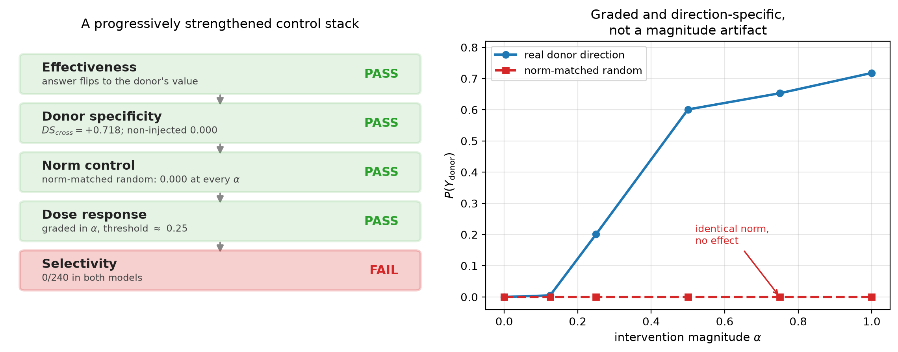
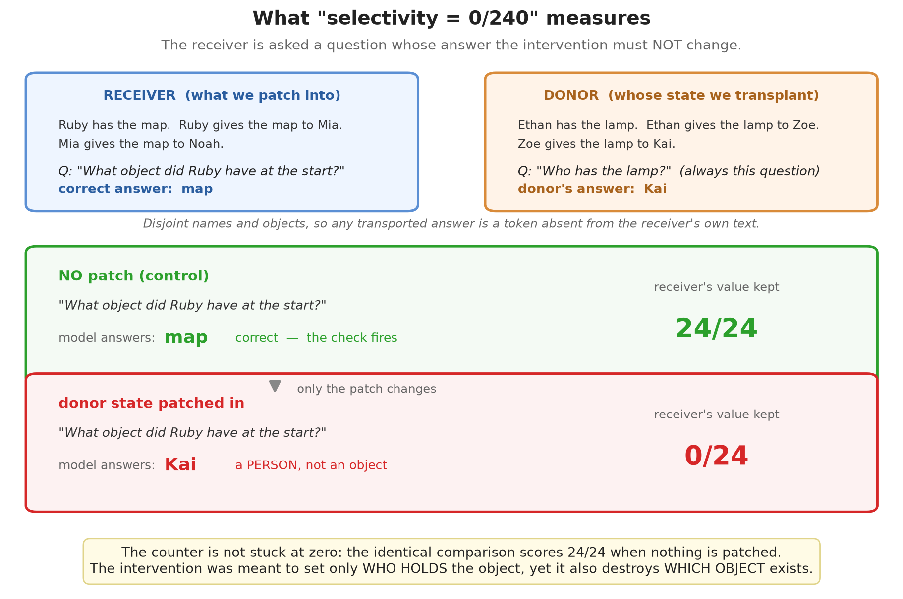
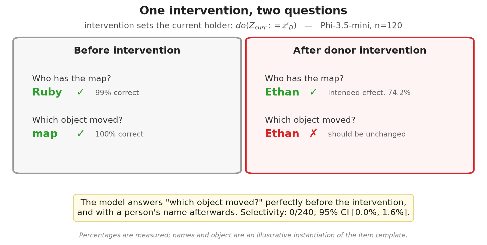
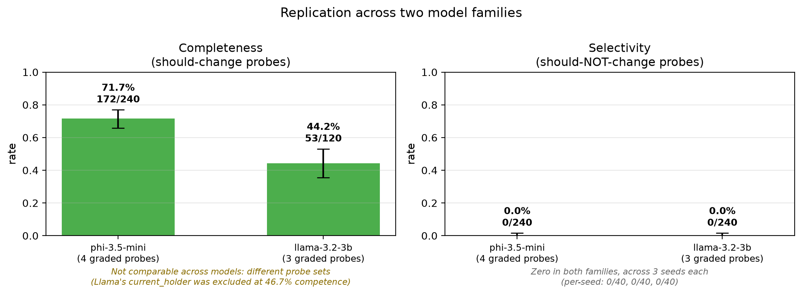

# Effective, Specific, and Non-Selective: Activation Interventions on Sequentially Computed State

*Draft 1. All numbers transcribed from `results/frozen_e91985c/` (commit `e91985c`). Experiments are frozen; no number in this document may be changed without a corresponding change to that snapshot.*

---

## Abstract

Interpretability research increasingly validates activation interventions by showing that they produce an intended counterfactual answer. RAVEL established that this is insufficient for static entity attributes: a faithful intervention must also leave unrelated attributes intact, and MIB reports that full-vector interventions fail exactly this test. We ask whether the same distinction holds when the target is not a stored attribute but a state computed over several reasoning steps. Using a transfer task with a known causal program (`holder_{t+1} = recipient_t`), we construct an intervention that passes a progressively strengthened battery of controls: it changes the answer, it is specific to the donor whose state was transplanted (DS = +0.718, with non-injected donors at 0.000), it is inert under a norm-matched random direction at every magnitude, and it is graded in magnitude. We then query the same intervened forward pass about quantities the causal program says must not change. Selectivity is 0/240 in two model families (95% CI [0.0, 1.6%]). Phi-3.5-mini answers "which object moved?" with 100% accuracy unintervened, and with a person's name afterwards. Behavioral control of a reasoning answer does not imply control of the reasoning state.

---

## 1. Introduction

An activation intervention is usually validated by its effect on a single output: patch a representation, observe that the model now produces the counterfactually correct answer, conclude that the representation carried the variable of interest. Interchange-intervention accuracy formalizes this as agreement between the network's output and a high-level causal model's output under corresponding interventions.

This criterion has a known limitation. **RAVEL** (Huang et al., ACL 2024) showed that for static entity attributes, changing the target answer is only half of what a faithful intervention must do: intervening on a city's continent should change the answer to a continent question *and leave the language question alone*. **MIB** (Mueller et al., ICML 2025) incorporates this logic through balanced counterfactuals and reports that full-vector baselines perform poorly on RAVEL precisely because swapping a whole vector perturbs unrelated attributes rather than isolating the target.

Both results concern **attributes that the model retrieves**: a city's continent is a static property, present in the representation because the entity was mentioned. We ask whether the effectiveness/selectivity distinction behaves the same way when the target is a **state the model must compute** — a value that does not exist in any single token of the input and is only defined after several reasoning steps.

Our contribution is an extension, not a new method or a new diagnostic:

> RAVEL's effectiveness/selectivity distinction survives the move from static attributes to sequentially computed state, and an intervention that passes a substantially stronger control battery than "the answer changed" still fails it completely.

We do not claim that selective interventions on reasoning state are impossible, that interchange-intervention accuracy is invalid, or that existing methods patch representations carelessly. DAS restricts its NLI interventions to the `[CLS]` representation; MIB brute-forces over manually selected token locations. Our result is a counterexample in a controlled setting, and it is bounded accordingly in §7.

---

## 2. Task: a sequentially computed causal variable

We use a transfer task in which objects pass between people:

```
Ava has the ring.  Liam has the book.
Ava gives the ring to Emma.  Liam gives the book to Henry.
Emma gives the ring to Owen.  Henry gives the book to Grace.
Who has the ring?                                    -> Owen
```

The causal program is explicit:

```
holder_0   = the initial holder named in the first sentence
holder_{t+1} = recipient_t
Z_curr     = holder_k  after k transfers
```

Three properties make this a usable testbed.

**The target is computed, not retrieved.** `Z_curr` is not a property of any entity in the prompt; it is the result of following a chain. A recency heuristic fails by construction, because each round ends with a *distractor* transfer, so the most recently named person never holds the queried object.

**The same body text supports several variables.** Over one unchanged chain we can query the current holder, the last recipient, the original holder (`holder_0`), the identity of the transferred object, and the number of transfers. The causal program says an intervention setting `Z_curr` must change the first two and must not change the last three. This yields a *predicted consequence pattern* rather than a single expected answer.

**Vocabulary is controlled.** Names and objects are drawn from pools filtered so every answer is a single token in both tokenizers, checked against the in-context form (`"the" vs "the " + word`) rather than a naive leading-space form, which SentencePiece splits. Donor and receiver items use disjoint names and objects, so a successfully transported answer is a token absent from the receiver's own context and cannot be explained by its surface content.

---

## 3. Intervention protocol

Let `h_D` and `h_R` be the residual-stream activations of a donor and a receiver at layers `L = [18, 20, 22, 24]`, at the final pre-answer token position. The intervention adds

```
v = α · (h_D − h_R)
```

to the receiver's activations at those layers and that position, with `α = 1` unless stated. At `α = 1` this is exact replacement of the receiver's state with the donor's.

**Position.** The final pre-answer token was selected empirically before any held-out item was scored, and the choice is consequential: at the mid-sentence recipient-name position the same oracle intervention scored 0/8, while at the final position it scored 6/8 with the identical layer set. A position sweep (§6) finds effects *only* at the final position. We return to what this implies in §7.

**Few-shot prefix.** Every prompt carries a few-shot prefix covering all five question forms, so no probe is disadvantaged by unfamiliar formatting and priming is identical across conditions. This matters: with a two-form prefix the current-holder transport rate was 24/24; under the five-form prefix it is 74.2%. We report the harder number.

**The donor is always asked the canonical question.** The donor prompt always ends with "Who has the {object}?", so its final-token state corresponds to `do(Z_curr := z'_D)`. That single state is then patched into receivers asked *different* questions. This is what makes the consequence pattern measurable.

---

## 4. The control stack

Before testing selectivity we establish that the intervention is worth taking seriously. Each control is progressively harder to pass.

**Effectiveness.** The patched receiver produces the donor's answer. On Phi-3.5-mini, 74.2% [65.7, 81.2] on the current-holder probe.

**Donor specificity.** Measured as a cross-term *within a single patched pass*, not by comparing two separate interventions. After patching donor D:

| quantity | baseline | after `do(D)` |
|---|---:|---:|
| P(Y_donor), the injected answer | 0.000 | **0.718** |
| P(Y_other), a donor *not* injected | 0.066 | **0.000** |
| P(Y_receiver), the receiver's own answer | 0.604 | **0.000** |

`DS_cross = +0.718`. Top-1 is the injected donor 13/16; top-1 is a non-injected donor 0/16. The output tracks *which* donor was supplied and does not drift toward arbitrary names.

> **A measurement correction worth recording.** We initially compared "patch D → P(Y_D)" against "patch a random donor R → P(Y_R)", found both succeeded at similar rates (75% vs 72%), and read this as absence of specificity. That inference is wrong: both are legitimate interchange interventions with different donors, and the causal model predicts both should succeed. A random donor is not a control that ought to fail. Specificity must be a cross-term within one pass. We also verified that the near-equality was not driven by label collision (2/32 items had a random donor whose answer coincided with the correct donor's; enforcing a collision-free derangement left the result unchanged) and that a true no-op self-patch reproduces the baseline exactly 32/32.

**Norm control.** A Gaussian direction rescaled to *exactly* the norm of `h_D − h_R` produces a change in P(Y_donor) of **0.000 at every α**. The effect requires a genuine model-state direction; injected magnitude alone does nothing.

**Dose response.** P(Y_donor) rises smoothly with α — 0.005, 0.201, 0.601, 0.653, 0.718 at α = 0.125, 0.25, 0.5, 0.75, 1.0 — with a threshold near α ≈ 0.25. The effect is graded, not an unstable all-or-nothing flip.

<figure>

<figcaption><strong>Figure 1.</strong> Left: each credential in the control stack, in the order applied. Right: the intervention is graded in magnitude, while a direction with identical norm produces no effect at any magnitude.</figcaption>
</figure>

---

## 5. Selectivity evaluation

The donor state is patched into receivers asked each of five probes. The causal program predicts which must change.

| probe | question | should change? |
|---|---|---|
| current_holder | Who has the {object}? | YES → donor's value |
| last_recipient | Who received the {object} last? | YES → donor's value |
| original_holder | Who originally had the {object}? | NO → receiver's value |
| object_identity | What object did {first} have at the start? | NO → receiver's value |
| transfer_count | How many times was the {object} given away? | NO → receiver's value |

**Competence gate.** A selectivity failure is only interpretable on probes the model can answer *unintervened*. Probes below 50% baseline competence are excluded, because a post-intervention change on a question the model could never answer tells us nothing.

**Sampling.** 3 seeds × 40 pairs = **120 independent pairs per model**. Each seed resamples both the item pairs *and* the few-shot prefix. The intervention itself is deterministic — zero-initialized, `eval()` mode, no optimizer — so pairs and prefix are the only stochastic components, and the prefix is a genuine confound worth varying. Wilson 95% intervals are computed over independent pairs within each probe, never over pooled probe-outcomes.

### 5.1 Phi-3.5-mini (primary)

| probe | should change? | baseline competence | → donor | → receiver |
|---|---|---:|---:|---:|
| current_holder | YES | 99.2% [95.4, 99.9] | 74.2% [65.7, 81.2] | **0/120** [0.0, 3.1] |
| last_recipient | YES | 97.5% [92.9, 99.1] | 69.2% [60.4, 76.7] | **0/120** [0.0, 3.1] |
| original_holder | NO | 100.0% [96.9, 100] | 60.0% [51.1, 68.3] | **0/120** [0.0, 3.1] |
| object_identity | NO | 100.0% [96.9, 100] | 71.7% [63.0, 79.0] | **0/120** [0.0, 3.1] |
| transfer_count | NO | 20.8% — *excluded* | 85.8% | 0/120 |

- **Completeness** 172/240 = 71.7% [65.7, 77.0]
- **Selectivity** 0/240 = **0.0%** [0.0, 1.6]
- Per-seed selectivity: 0/40, 0/40, 0/40 on both graded should-not-change probes

### 5.2 Llama-3.2-3B (corroborates selectivity only)

| probe | should change? | baseline competence | → donor | → receiver |
|---|---|---:|---:|---:|
| current_holder | YES | 46.7% — *excluded* | 50.0% | 0/120 |
| last_recipient | YES | 73.3% [64.8, 80.4] | 44.2% [35.6, 53.1] | **0/120** [0.0, 3.1] |
| original_holder | NO | 100.0% [96.9, 100] | 46.7% [38.0, 55.6] | **0/120** [0.0, 3.1] |
| object_identity | NO | 100.0% [96.9, 100] | 49.2% [40.4, 58.0] | **0/120** [0.0, 3.1] |
| transfer_count | NO | 18.3% — *excluded* | 49.2% | 0/120 |

- **Completeness** 53/120 = 44.2% [35.6, 53.1]
- **Selectivity** 0/240 = **0.0%** [0.0, 1.6]

**Llama's completeness is not comparable to Phi's**, and we do not present it as such. Llama graded three probes; Phi graded four, because Llama's current-holder probe fell below the competence gate at 46.7%. Llama cannot reliably perform the primary task at this sample size, so it supports the *selectivity* claim — where both its graded should-not-change probes have 100% baseline competence — and not the completeness claim.

### 5.3 Is the metric capable of firing?

A counter that always reads zero is indistinguishable from a broken counter, so we verify the instrument directly.

The selectivity check and the baseline competence check are **the same comparison against the same target token**, differing only in whether the patch is applied:

```
competence : prediction == first_id(unpatched_answer(receiver, probe))   # zero patch
to_receiver: prediction == first_id(unpatched_answer(receiver, probe))   # donor patch
```

So the 100% baseline competence on `original_holder` and `object_identity` already demonstrates that the selectivity check fires at ceiling when nothing is patched. We confirm this empirically in a single process on identical items (`src/validate_selectivity_metric.py`, Phi, n=40 per probe):

| condition | receiver's value retained |
|---|---:|
| zero patch (no intervention) | **80/80** |
| donor patch | **0/80** |

Only the patch differs. The metric is live, and the intervention alone drives it to zero. The same run shows where the probability mass goes: the model answers with the *donor's* value on 21/40 `original_holder` and 26/40 `object_identity` items.

<figure>

<figcaption><strong>Figure 4.</strong> What the selectivity counter counts. The identical comparison scores 24/24 with no intervention and 0/24 with the donor patch; only the patch differs, so the zero reflects the intervention rather than a metric that cannot fire.</figcaption>
</figure>

### 5.4 The concrete failure

Both models answer *"What object did {first} have at the start?"* with **100% accuracy unintervened**. After an intervention that, by construction, sets only who currently holds the object, Phi answers with a **person's name** on 71.7% of items. No reading of `do(Z_curr := z'_D)` permits changing which object exists in the problem.

This is difficult to attribute to misunderstanding the question: the model answered it perfectly moments earlier. The intervention destroyed the semantic isolation between the targeted answer state and unrelated information.

<figure>

<figcaption><strong>Figure 2.</strong> One intervention, two questions. The object-identity question is answered perfectly unintervened and with a person's name afterwards. Percentages are measured; names and object are an illustrative instantiation of the item template.</figcaption>
</figure>

<figure>

<figcaption><strong>Figure 3.</strong> Replication across two model families, Wilson 95% intervals over independent pairs. The completeness bars are <em>not</em> comparable across models: Llama graded three probes to Phi's four, because Llama's current-holder probe fell below the competence gate.</figcaption>
</figure>

---

## 6. Supporting observations

These support the interpretation but are not independent contributions.

**The effect is confined to the answer boundary.** Patching at positions −2 through −7 (the queried object, "the", "has", "Who", the sentence-final period, the recipient name) produces **0/12** transport for both correct and random donors, while position −1 produces 9/12. There is no intermediate regime in which the effect is present but weaker.

**Compact subspaces do not carry it either.** At rank 32, projected interchange through tracking, PCA, random, gradient-coordinate and learned-causal bases all produce 0/32, while the full-space oracle produces 24/32. Random bases fail at every rank in both architectures, and PCA performs comparably to a clean-minus-corrupt tracking basis through the useful rank regime — evidence that the tracking contrast does not identify a privileged reasoning subspace.

**Successful edits are not geometrically diverse.** We tested whether behaviorally equivalent edits must be internally similar, since a negative answer would have offered an alternative explanation for our results. Across 17 restarts × 3 examples with randomized initialization, median pairwise cosine between successful edits is +0.840, +0.912, +0.948. Solutions travel ~2.5× their initialization norm and end nearly orthogonal to their starting points (cos ≈ 0.02), then converge on the same direction regardless. Independently initialized optimizations find essentially one solution, so intervention non-uniqueness does not explain the selectivity failure. *(This also accounts for the low cosine ≈ 0.08–0.15 observed between unconstrained and subspace-confined edits: that is forced by confining a vector to a rank-32 slice of a 3072-dimensional space, not evidence of distinct solutions.)*

---

## 7. Discussion

**What the experiment establishes.** In this setting, an intervention can satisfy effectiveness, donor specificity, norm control, and dose-response while exercising no selective control over the reasoning variable it appears to manipulate. The four credentials are jointly insufficient. A two-probe consequence check detects this at negligible cost.

**What it does not establish.** It does not show that interchange-intervention accuracy is invalid — MIB uses it deliberately to align features with *specified* variables, and Sutter et al. (NeurIPS 2025) already demonstrate a sharper limitation, obtaining 100% IIA on randomly initialized language models with sufficiently powerful alignment maps. Nor does it show that selective interventions on reasoning state are impossible; we tested one intervention family at one site.

**The obvious objection, conceded.** A reader may respond: you patched the final pre-answer token, so of course you manipulated an answer representation. We agree, and the position sweep is our evidence *for* that reading rather than against it — effects appear only where answer information becomes directly actionable and propagate from nowhere earlier. The finding is not that a carelessly chosen site gives a careless result. It is that an intervention at this site passes four escalating credentials that a practitioner would reasonably accept, and the site is therefore part of the finding rather than an excuse for it. Established methods do not select sites this way, which is precisely why the credential stack, not the site, is the object of study.

**Relation to prior work.** RAVEL contributes the effectiveness/selectivity distinction; MIB contributes its benchmark operationalization and the observation that full-vector interventions fail it for entity attributes. Our addition is narrow: the same failure occurs for a *computed* state, and it survives a control battery considerably stronger than answer-change alone.

---

## 8. Limitations

1. **One task family.** A single transfer-chain task with one causal program. We make no claim of universality.
2. **Selectivity rests on two probes per model.** `transfer_count` was excluded in both models (20.8% and 18.3% competence): neither can count transfers unprompted, so post-intervention changes there are uninterpretable.
3. **Llama supports only part of the claim.** Its current-holder competence is 46.7% at n=120, so its completeness figure is computed on a different probe set and is not comparable to Phi's.
4. **One intervention site and one layer set.** Layers [18, 20, 22, 24] at the final pre-answer position. Other sites may behave differently — indeed §6 shows they behave *very* differently.
5. **Competence is not shown to drive the effect.** Phi has both higher baseline accuracy and stronger intervention takeover, but two models cannot establish a relationship between competence and selectivity failure. The defensible statement is narrower: **the selectivity failure cannot be explained by poor baseline task competence, since it persists in Phi at 99–100% baseline accuracy on all graded probes.**
6. **Small-sample estimates were optimistic.** At n=24 Llama's current-holder competence appeared to be 88%; at n=120 with freshly resampled items it is 46.7%. Early-stage numbers in this literature, including our own, should be treated with caution.

---

## 9. Future work

The sharp dependence on intervention position — full effect at the final token, nothing one token earlier — suggests that selectivity may vary systematically along the computational trajectory. Mapping where interventions transition from state-level control to answer-level control, as a grid over layers and positions with a selectivity panel at each cell, is the natural next study and a substantially larger undertaking than the present one.

---

## References

- Huang, J., Wu, Z., Potts, C., Geva, M., Geiger, A. **RAVEL: Evaluating Interpretability Methods on Disentangling Language Model Representations.** ACL 2024. arXiv:2402.17700
- Mueller, A., Geiger, A., Wiegreffe, S., et al. **MIB: A Mechanistic Interpretability Benchmark.** ICML 2025. arXiv:2504.13151
- Geiger, A., Wu, Z., Potts, C., Icard, T., Goodman, N. **Finding Alignments Between Interpretable Causal Variables and Distributed Neural Representations.** CLeaR 2024. arXiv:2303.02536
- Geiger, A., Lu, H., Icard, T., Potts, C. **Causal Abstractions of Neural Networks.** NeurIPS 2021. arXiv:2106.02997
- Sutter, D., Minder, J., Hofmann, T., Pimentel, T. **The Non-Linear Representation Dilemma: Is Causal Abstraction Enough for Mechanistic Interpretability?** NeurIPS 2025 Spotlight. arXiv:2507.08802

---

## Appendix A: reproduction

| component | script |
|---|---|
| item generation | `src/interchange_dataset.py` |
| intervention mechanics | `src/causal_interchange.py` |
| cross-question panel | `src/test_cross_question_panel.py` |
| donor specificity | `src/test_cross_term_specificity.py` |
| magnitude sweep | `src/sweep_interchange_magnitude.py` |
| position sweep | `src/sweep_interchange_position.py` |
| uniqueness falsification | `src/test_solution_uniqueness.py` |
| selectivity metric validation | `src/validate_selectivity_metric.py` |
| figures 1-3 | `src/make_paper_figures.py` |
| figure 4 | `src/make_selectivity_explainer.py` |

Frozen outputs: `results/frozen_e91985c/`. The panel runs predate the `--out` flag and cannot be regenerated, since each seed resamples both pairs and prefix; `paper/figure_data.json` is a hand transcription of those logs and figures are built from it.
